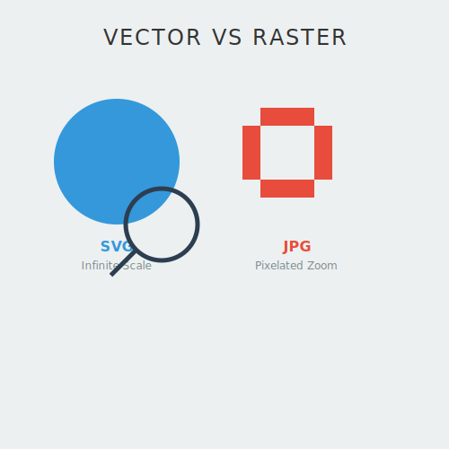

# RECURSO VISUAL: ILUSTRACIÓN DEL TEMA

# VECTORES VS MAPAS DE BITS: LA BASE DIGITAL

**Tiempo estimado**: 15 minutos
**Nivel**: Fundamentos
**Prerrequisitos**: Ninguno

## ¿Por qué importa este concepto?
Antes de aprender a "hablar" SVG, debes entender qué *es* SVG.
En el mundo digital, hay dos religiones: los Píxeles (Raster) y las Matemáticas (Vectores).
SVG es el rey de las matemáticas visuales. Entender la diferencia es la clave para saber cuándo usar un JPG y cuándo un SVG.

---

## 1. El Mapa de Bits (Raster)
Imagina un mosaico de azulejos.
- **Formato**: JPG, PNG, GIF.
- **Cómo funciona**: Una cuadrícula fija de puntos de color (píxeles).
- **El problema**: Si te acercas mucho (zoom) o estiras la imagen, los "azulejos" se ven gigantes. La imagen se pixela. No puedes recuperar detalle que no existe.

## 2. El Gráfico Vectorial
Imagina una receta de cocina o un plano de arquitecto.
- **Formato**: SVG, AI, EPS.
- **Cómo funciona**: No guarda la imagen final, guarda las **instrucciones** para dibujarla.
  - "Dibuja un círculo rojo de radio 50 en el centro".
  - "Traza una línea desde A hasta B".
- **El superpoder**: Si estiras la imagen, el ordenador simplemente recalcula la fórmula. "Dibuja un círculo de radio 5000". El borde sigue siendo matemáticamente perfecto.

---

## Comparativa Práctica

| Característica | Raster (JPG/PNG) | Vector (SVG) |
| :--- | :--- | :--- |
| **Resolución** | Fija (se pixela al escalar) | Infinita (siempre nítido) |
| **Peso archivo** | Aumenta con el tamaño (px) | Aumenta con la complejidad (objetos) |
| **Uso ideal** | Fotografías, texturas complejas | Logos, iconos, interfaces, ilustraciones |
| **Editable** | No (píxeles planos) | Sí (puedes cambiar atributos por código) |

---

## Conexión con conocimientos previos
Es la diferencia entre **escanear** un texto (imagen, no editable, se ve mal al zoom) y tener el **archivo de Word** original (texto real, cambias la fuente, tamaño infinito). SVG es el "archivo de Word" de los gráficos.

---

## Resumen del concepto

**En una frase**: Los píxeles son pintura seca; los vectores son instrucciones vivas.

**Cuándo usarlo**: Usa SVG para todo lo que sea gráfico, logo interfaz. Usa JPG solo para fotos realistas.

**Siguiente paso**: Ahora que sabemos QUÉ es, vamos a ver CÓMO se escribe usando su lenguaje nativo: **XML**.

## 🕹️ LABORATORIO VIRTUAL

> [!TIP]
> **Experiencia Práctica**: Simulación Interactiva: Vector vs Raster
> 
> [Abrir Simulación](../../recursos/simulaciones/sim_0.1_vector_raster.html)

