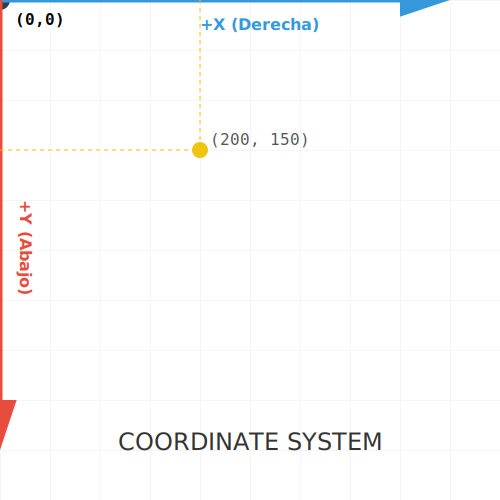

# RECURSO VISUAL: ILUSTRACIÓN DEL TEMA

# EL SISTEMA DE COORDENADAS: TU MAPA

**Tiempo estimado**: 20 minutos
**Nivel**: Fundamentos
**Prerrequisitos**: Ninguno

## ¿Por qué importa este concepto?
Si le dices al navegador "dibuja un punto en 10,10", ¿dónde aparece?
En la escuela aprendiste que la Y aumenta hacia arriba. En la web (y en casi todos los gráficos por computadora), es al revés.
Si no entiendes esto, tus dibujos aparecerán "patas arriba" o fuera de la pantalla.

---

## 1. El Origen (0,0)
El punto **(0,0)** está en la **esquina superior izquierda** de tu `<svg>`.
Todo nace desde ahí.

## 2. Los Ejes
- **Eje X (Horizontal)**: Aumenta hacia la **derecha** (como siempre). `x="100"` está a la derecha de `x="0"`.
- **Eje Y (Vertical)**: Aumenta hacia **abajo**. `y="100"` está *debajo* de `y="0"`.

> **💡 Regla de Oro**: Si quieres subir, RESTA en Y. Si quieres bajar, SUMA en Y.

## 3. Unidades
Por defecto, 1 unidad = 1 píxel.
Pero esto cambia si usas `viewBox` (algo que veremos en el Módulo 4). Por ahora, asume píxeles.

---

## Conexión con conocimientos previos
Es como leer un libro. Empiezas arriba a la izquierda. A medida que avanzas en la página (Y aumenta), vas hacia abajo.

---

## Resumen del concepto

**En una frase**: El mundo SVG empieza arriba a la izquierda y cae hacia abajo.

**Cuándo usarlo**: En CADA coordenada que escribas (rect x/y, circle cx/cy, path d).

**Siguiente paso**: Ya sabemos dibujar formas. Pero, ¿cómo interactuamos con ellas? Vamos a ver el **DOM**.

## 🕹️ LABORATORIO VIRTUAL

> [!TIP]
> **Experiencia Práctica**: Simulación Interactiva: Juego de Coordenadas
> 
> [Abrir Simulación](../../recursos/simulaciones/sim_0.3_coords.html)

