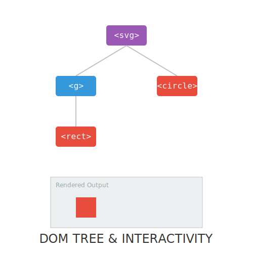

# RECURSO VISUAL: ILUSTRACIÓN DEL TEMA

# EL DOM: SVG ESTÁ VIVO

**Tiempo estimado**: 15 minutos
**Nivel**: Fundamentos
**Prerrequisitos**: Ninguno

## ¿Por qué importa este concepto?
Si vienes de usar Photoshop o Illustrator, estás acostumbrado a "capas" planas.
En la web, cada objeto SVG es parte del **Document Object Model** (DOM).
Esto significa que cada círculo es un ciudadano de primera clase en tu página web.

---

## 1. Nodos y Árboles
Tu archivo SVG es un árbol genealógico.
- El abuelo es `<svg>`.
- El padre es `<g>` (un grupo).
- El hijo es `<rect>`.

Al ser nodos del DOM, puedes encontrarlos con JavaScript: `document.getElementById('mi-rectangulo')`.

## 2. Interactividad (CSS y JS)
Porque son nodos del DOM, escuchan eventos:
- `:hover` en CSS funciona.
- `onclick` en JS funciona.
- `animation` en CSS funciona.

No necesitas aprender una API gráfica nueva. Si sabes animar un `div`, sabes animar un SVG.

---

## Conexión con conocimientos previos
Un JPG es una caja negra cerrada. No puedes "hablar" con el árbol dentro de la foto.
Un SVG es una caja de cristal abierta. Puedes meter la mano y mover el árbol.

---

## Resumen del concepto

**En una frase**: SVG no es una imagen; es una estructura de datos viva.

**Cuándo usarlo**: Cuando quieras que tu gráfico reaccione al usuario (cambie de color al pasar el mouse, se mueva al hacer clic).

**Siguiente paso**: ¡Felicidades! Has completado la nivelación. Tienes los fundamentos teóricos. En el próximo módulo, empezaremos a escribir código real y dibujar nuestras primeras formas.

## 🕹️ LABORATORIO VIRTUAL

> [!TIP]
> **Experiencia Práctica**: Simulación Interactiva: Explorador DOM
> 
> [Abrir Simulación](../../recursos/simulaciones/sim_0.4_dom_tree.html)

