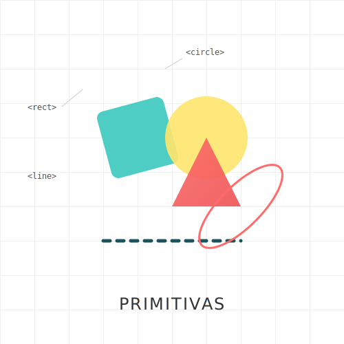
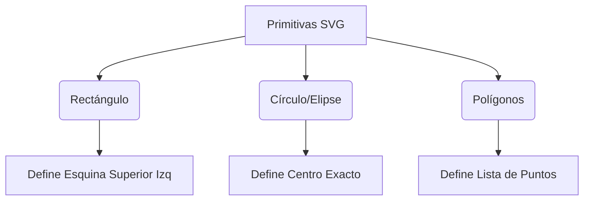

# RECURSO VISUAL: ILUSTRACIÓN DEL TEMA



# PRIMITIVAS DE FORMA BÁSICA: RECT, CIRCLE, ELLIPSE, POLYGON

**Tiempo estimado**: 30 minutos
**Nivel**: Básico
**Prerrequisitos**: Concepto de Coordenadas (Módulo 0)

## ¿Por qué importa este concepto?

Antes de correr, debes caminar. Las formas primitivas (`<rect>`, `<circle>`, `<ellipse>`, `<line>`, `<polyline>`, `<polygon>`) son los bloques de construcción fundamentales de cualquier gráfico vectorial. Aunque el elemento `<path>` puede dibujarlo todo, las primitivas son semánticamente más claras, más fáciles de leer por humanos, y usualmente más performantes para el navegador cuando se trata de figuras simples. Imagina intentar dibujar un cuadrado perfecto calculando cuatro líneas conectadas versus simplemente decir "quiero un cuadrado de 50x50".

## Conexión con conocimientos previos

En el Módulo 0 vimos cómo el sistema de coordenadas define *dónde* están las cosas. Ahora definiremos *qué* son esas cosas. Usaremos el lienzo infinito que aprendiste a manipular.

---

## Comprensión intuitiva

Piensa en las primitivas SVG como herramientas de estarcido (stencils) prefabricadas.
- **Rect**: Tu regla cuadrada.
- **Circle**: Tu compás fijado a un radio.
- **Line**: Tu regla recta.
- **Polygon**: Tu capacidad de conectar puntos numerados.

No necesitas calcular la ecuación de una circunferencia; solo le dices al navegador "¿Dónde está el centro?" y "¿Qué tan grande es el radio?".

### Ejemplo motivador

Diseñar un botón de interfaz (UI) simple.
Podrías dibujar 4 líneas para los bordes, pero un `<rect>` te da control sobre el ancho, alto y esquinas redondeadas (`rx`, `ry`) "gratis" con solo unos atributos.

---

## Definición formal

Las primitivas son elementos XML definidos en la especificación SVG 1.1/2.0 que representan formas geométricas estándar.

### Propiedades fundamentales

1.  **Rectángulo (`<rect>`)**: Definido por esquina superior izquierda `(x, y)` y dimensiones `(width, height)`.
2.  **Círculo (`<circle>`)**: Definido por centro `(cx, cy)` y radio `(r)`.
3.  **Elipse (`<ellipse>`)**: Similar al círculo, pero con dos radios: horizontal `(rx)` y vertical `(ry)`.
4.  **Línea (`<line>`)**: Segmento entre dos puntos `(x1, y1)` y `(x2, y2)`.
5.  **Polilínea (`<polyline>`)**: Serie de líneas conectadas que no necesariamente se cierran.
6.  **Polígono (`<polygon>`)**: Serie de líneas conectadas que **siempre** se cierran (el último punto conecta al primero automáticamente).

---

## Implementación práctica

### Código en SVG

```xml
<svg viewBox="0 0 200 200" xmlns="http://www.w3.org/2000/svg">
  
  <!-- Rectángulo: x,y definen la esquina superior izquierda -->
  <!-- rx crea esquinas redondeadas -->
  <rect x="10" y="10" width="80" height="50" rx="10" 
        fill="#FF5733" stroke="black" stroke-width="2" />

  <!-- Círculo: cx,cy es el centro preciso -->
  <circle cx="150" cy="35" r="25" 
          fill="#33FF57" />

  <!-- Elipse: rx y ry controlan el "aplastamiento" -->
  <ellipse cx="50" cy="100" rx="40" ry="20" 
           fill="#3357FF" />

  <!-- Línea: simple conexión entre dos puntos -->
  <line x1="10" y1="150" x2="90" y2="150" 
        stroke="black" stroke-width="5" stroke-linecap="round" />

  <!-- Polígono: Lista de puntos x,y x,y x,y -->
  <!-- Observa cómo se cierra automáticamente al final -->
  <polygon points="120,100 150,130 180,100 150,70" 
           fill="gold" stroke="orange" stroke-width="2" />
           
</svg>
```

### Análisis de atributos clave

- **x, y**: Coordenadas absolutas. Si se omiten, el valor por defecto es 0.
- **width, height**: Dimensiones. **IMPORTANTE**: Un valor de 0 deshabilita el renderizado del elemento.
- **rx, ry**: Radios para esquinas redondeadas (en rect) o radios de elipse.
- **points**: Lista de números separados por coma o espacio. `x1,y1 x2,y2 ...`

---

## Variantes y Optimizaciones

### Uso de `<use>` con Primitivas
Si vas a dibujar 50 círculos iguales, define uno en `<defs>` y usa `<use>` para replicarlos. Esto reduce el tamaño del DOM y mejora la legibilidad.

```xml
<defs>
  <circle id="miCirculo" r="10" fill="red" />
</defs>
<use href="#miCirculo" x="20" y="20" />
<use href="#miCirculo" x="50" y="50" />
```

---

## Errores frecuentes

### ❌ Error 1: Confundir `cx/cy` con `x/y`
El rectángulo usa `x,y` (esquina). El círculo usa `cx,cy` (centro).
Si usas `x` en un círculo, el navegador lo ignorará y lo dibujará en `cx=0`.

```xml
<!-- INCORRECTO: Se dibujará en el borde izquierdo (0, 50) -->
<circle x="50" y="50" r="10" />

<!-- CORRECTO -->
<circle cx="50" cy="50" r="10" />
```

### ❌ Error 2: Comas en `points`
Aunque SVG es tolerante y permite `10,10 20,20` o `10 10 20 20`, mezclar estilos indiscriminadamente hace el código ilegible.
**Recomendación**: Usa comas entre x e y, y espacios entre pares de coordenadas: `x,y x,y`.

---

## Visualización del concepto



---

## Resumen del concepto

**En una frase**: Las primitivas son formas geométricas predefinidas listas para usar, optimizadas y semánticas.

**Cuándo usarlo**: Siempre que tu diseño se componga de cajas, círculos o líneas rectas simples. Usa `<path>` solo cuando la forma sea irregular o compleja.

**Siguiente paso**: Aprender a agrupar estas formas para crear dibujos compuestos en **Grupos y Transformaciones**.


## 🕹️ LABORATORIO VIRTUAL

> [!TIP]
> **Experiencia Práctica**: Laboratorio: Primitivas SVG
> 
> [Abrir Simulación](../../recursos/simulaciones/sim_1.1.1_primitives.html)

