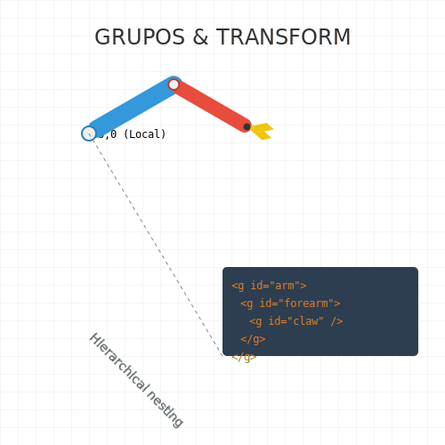

# RECURSO VISUAL: ILUSTRACIÓN DEL TEMA



# GRUPOS Y TRANSFORMACIONES: LA CAJA MÁGICA

**Tiempo estimado**: 40 minutos
**Nivel**: Intermedio-Básico
**Prerrequisitos**: Primitivas SVG (Subtema 1.1.1)

## ¿Por qué importa este concepto?

Imagina que has dibujado un coche usando 10 piezas diferentes (ruedas, ventanas, chasis). Si quieres mover el coche a la derecha, tienes dos opciones:
1.  **La difícil**: Calcular y cambiar la posición `x` de cada una de las 10 piezas.
2.  **La inteligente**: Meter todas las piezas en una "caja" y mover la caja completa.

El elemento `<g>` (Group) es esa caja. Y el atributo `transform` es la herramienta que te permite mover, girar o hacer más grande esa caja sin tener que tocar lo que hay dentro.

## Conexión con conocimientos previos

Piensa en `<g>` como una **Carpeta** en tu ordenador. Si mueves la carpeta, todos los archivos que hay dentro se mueven con ella. No necesitas mover los archivos uno por uno.

---

## Comprensión intuitiva

Para entender `transform`, imagina que tus dibujos están hechos sobre **hojas de acetato transparente**.
- **Sin `transform`**: Dibujas directamente sobre la mesa.
- **`translate`**: Deslizas la hoja de acetato sobre la mesa.
- **`rotate`**: Pones una chincheta en la hoja y la giras sobre ella.
- **`scale`**: Como si la hoja fuera de goma y la estiraras.

---

## Definición formal

### El Elemento `<g>`
Es un contenedor lógico. No se ve (no tiene borde ni fondo por defecto), pero sirve para dos cosas:
1.  **Agrupar**: Mueve todo el contenido junto.
2.  **Heredar Estilos**: Si pones `fill="red"` en el grupo, todos los círculos y rectángulos de dentro se volverán rojos (a menos que tengan su propio color).

### El Atributo `transform`
Es una lista de instrucciones para modificar el sistema de coordenadas (la hoja transparente):

1.  **`translate(x, y)`**: Mueve el origen. "Camina x pasos a la derecha e y pasos abajo".
2.  **`rotate(ángulo)`**: Gira alrededor del punto `(0,0)` actual.
3.  **`rotate(ángulo, cx, cy)`**: Gira alrededor de un punto específico `(cx, cy)`.
4.  **`scale(n)`**: Multiplica el tamaño. `scale(2)` hace todo el doble de grande.

---

## Implementación práctica

### Agrupando y Moviendo

Vamos a crear un coche y moverlo.

```xml
<svg viewBox="0 0 200 200" xmlns="http://www.w3.org/2000/svg">
  
  <!-- Definimos nuestro coche dentro de un grupo -->
  <!-- transform: Lo movemos 50px a la derecha y 50px abajo -->
  <g id="miCoche" transform="translate(50, 50)">
    
    <!-- El cuerpo del coche empieza en 0,0 (relativo al grupo) -->
    <rect x="0" y="0" width="60" height="30" fill="blue" />
    
    <!-- Ruedas -->
    <circle cx="15" cy="30" r="10" fill="black" />
    <circle cx="45" cy="30" r="10" fill="black" />
  </g>

  <!-- Podemos reutilizar el coche y transformarlo diferente -->
  <!-- Aquí lo movemos más lejos y lo rotamos 15 grados -->
  <use href="#miCoche" transform="translate(100, 100) rotate(15)" />

</svg>
```

### El Orden Importa

Cuidado: Las transformaciones se aplican en orden secuencial.
Imagina que eres un robot:
- `translate(100,0) rotate(45)`: "Camina 100 pasos. Ahora, gira 45 grados". (Estás lejos y girado).
- `rotate(45) translate(100,0)`: "Gira 45 grados. Ahora, camina 100 pasos". (Caminarás en diagonal).

---

## Errores frecuentes

### ❌ Error 1: La Rotación Loca
Por defecto, `rotate(45)` clava la chincheta en la esquina superior izquierda `(0,0)`. Si tu objeto está en el centro de la pantalla, parecerá que orbita alrededor de la esquina en lugar de girar sobre sí mismo.
**Solución**: Usa los tres números. `rotate(45, 100, 100)` (donde 100,100 es el centro de tu objeto).

### ❌ Error 2: Bordes Gordos
Si usas `scale(2)`, no solo el objeto crece, ¡el borde también! Un borde de 1px se convertirá en un borde de 2px.
**Solución**: A veces es mejor cambiar el `width` y `height` si no quieres que el borde engorde. O usar CSS avanzado (`vector-effect: non-scaling-stroke`).

---

## Resumen del concepto

**En una frase**: `<g>` es la carpeta para organizar, `transform` es la mano que mueve la carpeta.

**Cuándo usarlo**: Siempre que tengas un dibujo compuesto por más de una forma (un icono, un logo, un personaje).

**Siguiente paso**: Ahora que dominamos las cajas y cómo moverlas, vamos a aprender a dibujar formas que no son ni rectángulos ni círculos usando **El Elemento Path**.


## 🕹️ LABORATORIO VIRTUAL

> [!TIP]
> **Experiencia Práctica**: Laboratorio: Transformaciones
> 
> [Abrir Simulación](../../recursos/simulaciones/sim_1.1.2_transforms.html)

