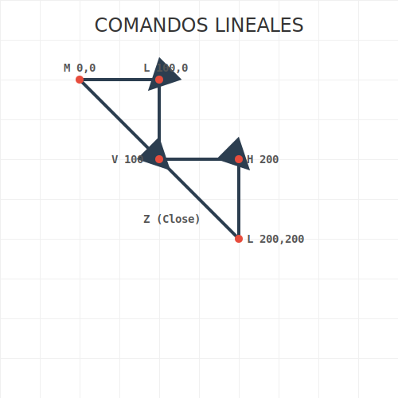

# RECURSO VISUAL: ILUSTRACIÓN DEL TEMA



# DOMINANDO EL ELEMENTO `<PATH>`: COMANDOS LINEALES

**Tiempo estimado**: 45 minutos
**Nivel**: Intermedio
**Prerrequisitos**: Coordenadas

## ¿Por qué importa este concepto?

`<path>` es el rey de SVG. Todo lo que has visto hasta ahora (rectángulos, círculos) son solo "atajos" para el elemento `<path>`.
El `<path>` te permite dibujar CUALQUIER forma imaginable, desde un icono simple hasta un mapa detallado de un país. Es como pasar de usar sellos de goma a tener una pluma estilográfica en la mano.

## Comprensión intuitiva

Imagina un plotter o un robot de dibujo. Para dibujar, necesitas darle instrucciones muy precisas:
1. "Levanta la pluma y muévela a X,Y" (Move).
2. "Baja la pluma y traza una línea hasta X,Y" (Line).
3. "Vuelve al punto de inicio" (Close).

El atributo `d` (data) del path es simplemente esa lista de instrucciones codificada en letras.

---

## Definición formal

El atributo `d` contiene una secuencia de comandos.
Cada comando consiste en una **Letra** seguida de **Números**.
- **Mayúsculas** (ej: `M 10 10`): Coordenadas **Absolutas** (ve al punto 10,10 del lienzo).
- **Minúsculas** (ej: `m 10 10`): Coordenadas **Relativas** (muévete 10 a la derecha y 10 abajo desde donde estás ahora).

### Comandos de Línea Recta

1.  **M (Move to)** `x y`: Mueve el cursor sin dibujar (levanta la pluma).
2.  **L (Line to)** `x y`: Dibuja una línea hasta las coordenadas dadas.
3.  **H (Horizontal line to)** `x`: Dibuja una línea horizontal (solo cambia X).
4.  **V (Vertical line to)** `y`: Dibuja una línea vertical (solo cambia Y).
5.  **Z (Close path)**: Cierra la forma trazando una línea recta al último punto `M`.

---

## Implementación práctica

### Dibujando un Triángulo
```xml
<svg viewBox="0 0 100 100" xmlns="http://www.w3.org/2000/svg">
  
  <!-- M: Mueve a 50,10 (Pico) -->
  <!-- L: Línea a 90,90 (Derecha abajo) -->
  <!-- L: Línea a 10,90 (Izquierda abajo) -->
  <!-- Z: Cierra volviendo a 50,10 -->
  
  <path d="M 50 10 L 90 90 L 10 90 Z" 
        fill="none" stroke="black" stroke-width="2" />
        
</svg>
```

### Relativo vs Absoluto
Dibujemos una escalera.
Con **Absoluto (L)**, debes calcular cada punto: 0,0 -> 10,0 -> 10,10 -> 20,10... ¡Agotador!
Con **Relativo (l)**, solo repites el patrón: "10 a la derecha, 10 abajo".

```xml
<!-- Escalera relativa -->
<!-- m 10 10: Empieza en 10,10 -->
<!-- h 10: 10 a la derecha -->
<!-- v 10: 10 abajo -->
<!-- Repetir... -->
<path d="m 10 10 h 10 v 10 h 10 v 10 h 10 v 10" 
      fill="none" stroke="blue" />
```

---

## Errores frecuentes

### ❌ Error 1: Olvidar el separador implícito
`M100 100L200 200` es válido.
`M100100L200200` NO es válido (ambigüedad en números).
Usa espacios para legibilidad: `M 100 100 L 200 200`.

### ❌ Error 2: Relleno no deseado
Por defecto, `<path>` tiene relleno negro (`fill="black"`).
Si estás dibujando líneas abiertas, verás una forma extraña negra conectando el principio y el final.
**Solución**: Usa `fill="none"` si solo quieres trazos.

---

## Resumen del concepto

**En una frase**: `<path>` es una serie de comandos de movimiento (`M`) y dibujo (`L, H, V`) descritos en el atributo `d`.

**Cuándo usarlo**: Cuando necesites formas que no sean rectángulos o círculos perfectos.

**Siguiente paso**: Las líneas rectas son aburridas. Vamos a curvar el espacio con **Curvas de Bézier**.


## 🕹️ LABORATORIO VIRTUAL

> [!TIP]
> **Experiencia Práctica**: Laboratorio: Trazador de Paths
> 
> [Abrir Simulación](../../recursos/simulaciones/sim_1.2.1_path_tracer.html)

