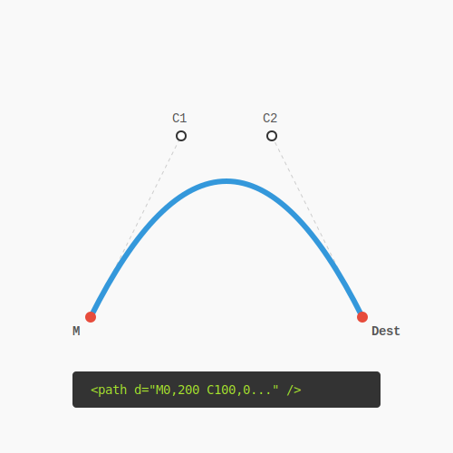
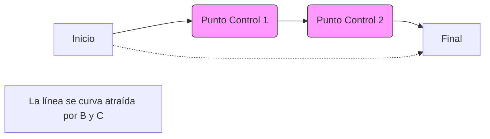

# RECURSO VISUAL: ILUSTRACIÓN DEL TEMA



# CURVAS DE BÉZIER: SUAVIZANDO EL TRAZO

**Tiempo estimado**: 60 minutos
**Nivel**: Avanzado
**Prerrequisitos**: Path Lineal (Subtema 1.2.1)

## ¿Por qué importa este concepto?
El mundo no es cuadrado. La naturaleza está llena de curvas.
Si solo usaras líneas rectas (`L`), necesitarías miles de pequeños segmentos para simular un círculo (como en los videojuegos antiguos).
Las curvas de Bézier te permiten describir formas suaves y orgánicas con matemática elegante y muy pocos puntos. Es la tecnología detrás de todas las fuentes tipográficas y los gráficos vectoriales modernos.

## Comprensión intuitiva
Imagínate que lanzas una cuerda entre dos puntos. Si está tensa, es una línea recta.
Ahora imagina que hay imanes invisibles fuera de la línea que tiran de la cuerda, deformándola hacia ellos sin tocarla.
- **Puntos de Anclaje**: Donde empieza y termina la cuerda.
- **Puntos de Control**: Los imanes que definen la curvatura.

---

## Definición formal

### Curva Cuadrática (`Q`)
Tiene **un solo punto de control**. La curva es tangente a la línea entre el inicio y el control, y entre el control y el final.
- Sintaxis: `Q controlX controlY finalX finalY`
- Ejemplo: `M 10 10 Q 50 50 90 10`

### Curva Cúbica (`C`)
Tiene **dos puntos de control**. Uno tira desde el inicio y el otro tira desde el final, permitiendo curvas en forma de "S" o más complejas.
- Sintaxis: `C c1x c1y c2x c2y finalX finalY`
- Ejemplo: `M 10 10 C 10 50 90 50 90 10`

### Comandos de Suavizado (`S`, `T`)
Permiten encadenar curvas asumiendo que el primer punto de control es el reflejo del último punto de control de la curva anterior, garantizando una transición suave (continuidad geométrica).

---

## Implementación práctica

### La Sonrisa (Cuadrática vs Cúbica)

```xml
<svg viewBox="0 0 200 100" xmlns="http://www.w3.org/2000/svg">
  
  <!-- Cuadrática (Q): Un imán en medio abajo -->
  <path d="M 10 50 Q 100 100 190 50" 
        fill="none" stroke="blue" stroke-width="5" />
  <!-- Imán fantasma para visualizar: (100, 100) -->
  <circle cx="100" cy="100" r="2" fill="blue" />

  <!-- Cúbica (C): Dos imanes. Permite una base más plana -->
  <path d="M 10 50 C 10 90 190 90 190 50" 
        fill="none" stroke="red" stroke-width="2" />
        
</svg>
```

### La Onda (Cúbica)
Para hacer una onda sinusoidal, necesitas controlar la subida y la bajada independientemente.
```xml
<!-- Mueve a 10,50 -->
<!-- C: Control1(40,0) tira arriba, Control2(60,100) tira abajo, Final(90,50) -->
<path d="M 10 50 C 40 0 60 100 90 50" 
      fill="none" stroke="purple" />
```

---

## Visualización del concepto



---

## Errores frecuentes

### ❌ Error 1: Perderse en los números
`C 10 10 20 20 30 30` puede ser confuso.
**Tip**: Agrúpalos mentalmente: `C (control1) (control2) (destino)`.

### ❌ Error 2: Picos no deseados
Si encadenas dos curvas manualmente y los puntos de control no están alineados con el punto de unión, tendrás un "pico" o esquina abrupta.
**Solución**: Usa `S` (Smooth Cúbica) o `T` (Smooth Cuadrática) para que el navegador calcule la tangente perfecta automáticamenete.

---

## Resumen del concepto

**En una frase**: `Q` usa un imán (curvas simples), `C` usa dos imanes (curvas complejas).

**Cuándo usarlo**: Para dibujar cualquier cosa orgánica: nubes, olas, logotipos fluidos.

**Siguiente paso**: ¡Felicidades! Has completado el Módulo 1. Tienes las herramientas para dibujar el universo. En el **Módulo 2**, aprenderemos a pintar ese universo con **Gradientes y Efectos**.


## 🕹️ LABORATORIO VIRTUAL

> [!TIP]
> **Experiencia Práctica**: Laboratorio: Curvas Bézier
> 
> [Abrir Simulación](../../recursos/simulaciones/bezier_playground.html)

