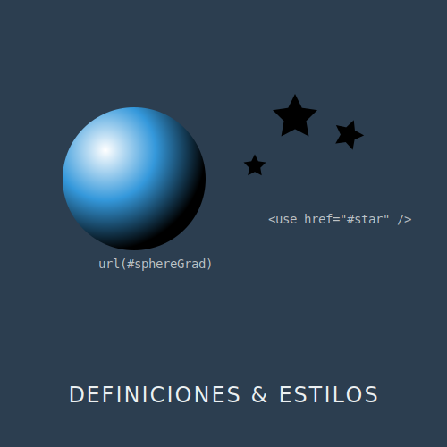

# RECURSO VISUAL: ILUSTRACIÓN DEL TEMA



# DEFINICIONES Y REUTILIZACIÓN: EL PODER DE `<DEFS>` Y `<USE>`

**Tiempo estimado**: 30 minutos
**Nivel**: Intermedio
**Prerrequisitos**: Grupos y Transformaciones (Subtema 1.1.2)

## ¿Por qué importa este concepto?
En programación, la regla de oro es DRY (Don't Repeat Yourself). En SVG, esa regla se cumple con `<defs>` y `<use>`.
Si estás dibujando un bosque, no dibujas 100 árboles individuales con 100 paths idénticos (eso inflaría tu archivo y mataría el rendimiento). Dibujas un solo árbol "platónico" en una dimensión paralela (defs) y luego proyectas 100 hologramas de ese árbol (use) donde quieras.
Esto reduce drásticamente el peso del archivo y hace que tu código sea mantenible. Si quieres cambiar las hojas del bosque entero, solo cambias el árbol original.

## Conexión con conocimientos previos
Ya sabes agrupar elementos con `<g>`. Ahora aprenderás a archivar esos grupos para usarlos después sin tener que reescribirlos.

---

## Comprensión intuitiva
- **`<defs>`**: Es el almacén o el "camerino". Todo lo que pongas aquí NO se dibuja en la pantalla. Está esperando.
- **`id`**: Es la etiqueta con la que llamas a lo que guardaste.
- **`<use>`**: Es la invocación. "Oye navegador, ¿recuerdas eso que llamé 'miIcono'? Dibújalo aquí".

---

## Definición formal

### El Elemento `<defs>`
Contenedor de elementos que serán referenciados pero no renderizados directamente. Se suele colocar al principio del SVG.

### El Elemento `<use>`
Toma un nodo del documento (por su ID) y lo clona en el árbol de renderizado sombra (shadow tree).
- **`href="#id"`**: Referencia al ID del elemento a clonar.
- **`x`, `y`**: Desplazamiento local para la instancia (se suma a lo que tenga el original).
- **`width`, `height`**: Solo funcionan si el original es un `<svg>` o `<symbol>`, no en formas simples.

---

## Implementación práctica

### El Bosque Eficiente

```xml
<svg viewBox="0 0 200 200" xmlns="http://www.w3.org/2000/svg">
  
  <!-- ALMACÉN (Invisible) -->
  <defs>
    <!-- Definimos un árbol base -->
    <g id="arbol">
      <!-- Tronco -->
      <rect x="-5" y="0" width="10" height="20" fill="brown" />
      <!-- Copa -->
      <circle cx="0" cy="-10" r="15" fill="green" />
    </g>
  </defs>

  <!-- ESCENA (Visible) -->
  
  <!-- Plantamos árboles usando translaciones -->
  <use href="#arbol" x="20" y="150" />
  <use href="#arbol" x="50" y="160" transform="scale(1.2)" />
  <use href="#arbol" x="100" y="140" transform="scale(0.8)" />
  
  <!-- Cuidado: 'x' en <use> es equivalente a un translate(x, 0) -->

</svg>
```

### `<symbol>` vs `<g>` en Defs
Si usas `<g>` dentro de defs, el `<use>` lo clona tal cual.
Si usas `<symbol>`, obtienes un superpoder extra: `viewBox` independiente.
Esto permite que tu icono tenga su propio sistema de coordenadas interno (ej. 0-24px) pero luego le declares un `width/height` arbitrario al usarlo.

```xml
<defs>
  <symbol id="icono-estrella" viewBox="0 0 24 24">
    <path d="..." />
  </symbol>
</defs>
<!-- Ahora puedo redimensionarlo fácilmente -->
<use href="#icono-estrella" width="50" height="50" />
```

---

## Errores frecuentes

### ❌ Error 1: ID duplicados
Los IDs deben ser únicos en TODA la página. Si incrustas 3 SVGs en tu HTML y todos tienen `<g id="icono">`, el navegador se confundirá y probablemente todos los `<use>` apunten al primero que encuentre.
**Solución**: Usa prefijos únicos, ej: `id="proyecto1-icono"`.

### ❌ Error 2: Estilos rebeldes
Si el elemento original en `<defs>` tiene `fill="red"`, no podrás cambiarle el color en el `<use>` diciendo `fill="blue"`. El estilo interno gana.
**Solución**: Deja el original sin estilos (o usa `fill="currentColor"`) para que pueda heredar el color del `<use>`.

---

## Resumen del concepto

**En una frase**: `<defs>` define activos reutilizables, `<use>` los instancia múltiples veces.

**Cuándo usarlo**: Sistemas de iconos, patrones repetitivos, o elementos complejos que aparecen más de una vez.

**Siguiente paso**: Ya sabemos clonar formas. Ahora vamos a aprender a pintarlas no solo con colores planos, sino con **Gradientes**.


## 🕹️ LABORATORIO VIRTUAL

> [!TIP]
> **Experiencia Práctica**: Laboratorio: Defs y Use
> 
> [Abrir Simulación](../../recursos/simulaciones/sim_2.1.1_stamper.html)

