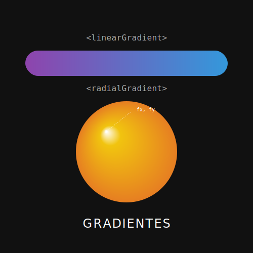

# RECURSO VISUAL: ILUSTRACIÓN DEL TEMA



# GRADIENTES: PINTURA DIGITAL EN CÓDIGO

**Tiempo estimado**: 50 minutos
**Nivel**: Intermedio
**Prerrequisitos**: Definiciones (Subtema 2.1.1)

## ¿Por qué importa este concepto?
El color plano (`fill="red"`) es funcional, pero a veces aburrido. El mundo real tiene sombras, luces y transiciones.
Los gradientes le dan vida, profundidad y volumen a tus gráficos. Un botón simple se convierte en un botón 3D brillante. Un círculo se convierte en una esfera.
SVG te ofrece dos pinceles mágicos: el Gradiente Lineal (transición recta) y el Gradiente Radial (transición circular).

## Conexión con conocimientos previos
Al igual que las formas reutilizables, los gradientes se deben **DEFINIR** primero dentro de `<defs>` y luego **USAR** en el atributo `fill` o `stroke` mediante una referencia `url(#id)`.

---

## Comprensión intuitiva
- **Linear Gradient**: Imagina pintar una pared empezando con pintura azul arriba y terminando con rosa abajo. Los colores se mezclan en el camino. Tú defines la "Línea del Gradiente" (de dónde a dónde va).
- **Radial Gradient**: Imagina dejar caer una gota de tinta en agua. El color se expande desde un centro hacia afuera en anillos concéntricos.

---

## Definición formal

### `<linearGradient>`
Define una transición lineal de colores a lo largo de un vector.
- **x1, y1**: Punto de inicio (por defecto 0%, 0%).
- **x2, y2**: Punto final (por defecto 100%, 0% -> Horizontal).
- **Hijos**: `<stop offset="%" stop-color="color" />`.

### `<radialGradient>`
Define una transición radial.
- **cx, cy**: Centro del círculo final (el color externo).
- **r**: Radio.
- **fx, fy**: Punto focal (dónde está el color interno, "el brillo").

---

## Implementación práctica

### El Atardecer (Linear)

```xml
<svg viewBox="0 0 200 100" xmlns="http://www.w3.org/2000/svg">
  <defs>
    <!-- Gradiente Vertical: x1=x2, y1(0) a y2(1) -->
    <linearGradient id="atardecer" x1="0" x2="0" y1="0" y2="1">
      <stop offset="0%" stop-color="#000033" /> <!-- Azul noche arriba -->
      <stop offset="50%" stop-color="#ff6600" /> <!-- Naranja medio -->
      <stop offset="100%" stop-color="#ffff00" /> <!-- Amarillo abajo -->
    </linearGradient>
  </defs>

  <!-- Aplicamos con url(#id) -->
  <rect width="200" height="100" fill="url(#atardecer)" />
</svg>
```

### La Esfera 3D (Radial)

```xml
<svg viewBox="0 0 100 100">
  <defs>
    <!-- Brillo desplazado para efecto 3D -->
    <radialGradient id="esfera3d" cx="50%" cy="50%" r="50%" fx="30%" fy="30%">
      <stop offset="0%" stop-color="white" />   <!-- Brillo especular -->
      <stop offset="100%" stop-color="blue" />  <!-- Color base -->
    </radialGradient>
  </defs>

  <circle cx="50" cy="50" r="40" fill="url(#esfera3d)" />
</svg>
```

---

## Variantes y Optimizaciones

### Spread Method
¿Qué pasa si el gradiente acaba antes de llenar la forma?
- `spreadMethod="pad"` (Defecto): Extiende el último color hasta el infinito.
- `spreadMethod="reflect"`: Espejo (Azul->Rojo->Azul->Rojo).
- `spreadMethod="repeat"`: Repite el patrón (Azul->Rojo, Azul->Rojo).

---

## Errores frecuentes

### ❌ Error 1: Coordenadas del vector
Por defecto, las coordenadas del gradiente (`x1`, `y1`...) son **Porcentajes** (relativos a la caja del objeto, `objectBoundingBox`).
Si pones `x2="100"`, el navegador piensa "10000%" (porque 1 = 100%).
**Solución**: Usa `%` explícito (`100%`) o decimales (`1`). O cambia `gradientUnits="userSpaceOnUse"` para usar píxeles absolutos.

### ❌ Error 2: Tramos duros
Si quieres una bandera (rayas sólidas) y no un difuminado, pon dos stops en el mismo offset.
`<stop offset="50%" color="red" />`
`<stop offset="50%" color="blue" />`
Esto crea un cambio instantáneo de rojo a azul.

---

## Resumen del concepto

**En una frase**: Los gradientes son definiciones que interpolan colores entre "paradas" (`stops`) a lo largo de una línea o radio.

**Cuándo usarlo**: Fondos, sombras suaves, efectos metálicos, botones con volumen.

**Siguiente paso**: Ya tenemos forma y color. Ahora vamos a aprender a mostrar solo lo que queremos con **Máscaras y Recortes**.


## 🕹️ LABORATORIO VIRTUAL

> [!TIP]
> **Experiencia Práctica**: Laboratorio: Editor de Gradientes
> 
> [Abrir Simulación](../../recursos/simulaciones/sim_2.1.2_gradients.html)

