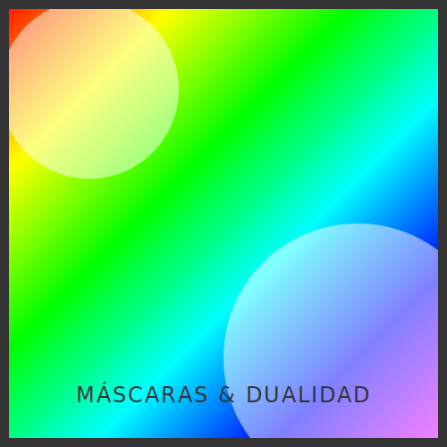

# RECURSO VISUAL: ILUSTRACIÓN DEL TEMA



# MÁSCARAS Y RECORTES: CLIPPATH VS MASK

**Tiempo estimado**: 50 minutos
**Nivel**: Avanzado
**Prerrequisitos**: Gradientes (Subtema 2.1.2)

## ¿Por qué importa este concepto?
A veces no importa lo que dibujas, sino lo que borras.
La capacidad de ocultar partes de un objeto es fundamental para efectos visuales avanzados (como meter una foto dentro de un círculo, o hacer un efecto de texto desgastado).
SVG tiene dos herramientas para esto, y confundirlas es el error #1 del novato:
1. **ClipPath**: Tijeras digitales. Recorte duro. O estás dentro o estás fuera.
2. **Mask**: Transparencia gradual. Puedes ser visible al 50%.

## Conexión con conocimientos previos
Usaremos `<defs>` de nuevo. Tanto los recortes como las máscaras se definen primero y se aplican después como un atributo (`clip-path` o `mask`).

---

## Comprensión intuitiva

- **ClipPath**: Imagina que tienes una foto y usas un cortador de galletas con forma de estrella. Todo lo que cae fuera de la estrella se tira a la basura. Los bordes son afilados.
- **Mask**: Imagina que pones un cristal ahumado sobre la foto. Donde el cristal es negro, no se ve nada. Donde es transparente, se ve la foto. Donde es gris, se ve semitransparente.

---

## Definición formal

### `<clipPath>`
Define una región vectorial. La visibilidad es binaria (1 o 0).
Solo usa la geometría de sus hijos, ignora sus colores.

### `<mask>`
Define un canal alfa de luminancia.
- **Blanco**: Opacidad 100% (Visible).
- **Negro**: Opacidad 0% (Invisible).
- **Gris/Gradiente**: Opacidad parcial.

---

## Implementación práctica

### Foto de Perfil Redonda (ClipPath)

```xml
<svg viewBox="0 0 200 200">
  <defs>
    <!-- Definimos la forma de corte -->
    <clipPath id="corte-circular">
      <circle cx="100" cy="100" r="80" />
    </clipPath>
  </defs>

  <!-- Aplicamos el corte a un cuadrado (o imagen) -->
  <rect x="0" y="0" width="200" height="200" fill="blue" 
        clip-path="url(#corte-circular)" />
        
  <!-- Resultado: Un círculo azul, aunque dibujamos un rect -->
</svg>
```

### Efecto Desvanecido (Mask)

```xml
<svg viewBox="0 0 200 200">
  <defs>
    <!-- 1. Definimos el gradiente (Negro a Blanco) -->
    <linearGradient id="g-fade">
      <stop offset="0%" stop-color="black" />   <!-- Invisible -->
      <stop offset="100%" stop-color="white" /> <!-- Visible -->
    </linearGradient>
    
    <!-- 2. Definimos la máscara usando ese gradiente -->
    <mask id="mascara-fade">
      <rect width="200" height="200" fill="url(#g-fade)" />
    </mask>
  </defs>

  <!-- 3. Aplicamos la máscara al objeto -->
  <circle cx="100" cy="100" r="80" fill="red" 
          mask="url(#mascara-fade)" />
          
  <!-- Resultado: Círculo rojo que se desvanece de izquierda a derecha -->
</svg>
```

---

## Variantes y Optimizaciones

### Recorte de Texto
Puedes usar `<text>` dentro de un `<clipPath>`.
Esto permite poner una imagen o un video DE FONDO de un texto (el famoso efecto "knockout").

```xml
<clipPath id="texto-recorte">
  <text x="0" y="50" font-size="40" font-weight="bold">HOLA</text>
</clipPath>
<image href="paisaje.jpg" clip-path="url(#texto-recorte)" ... />
```

---

## Errores frecuentes

### ❌ Error 1: Usar clip para desvanecer
"Quiero que el borde se difumine". Y usas `clipPath`.
Resultado: Borde duro pixelado.
**Solución**: Única y exclusivamente `mask`.

### ❌ Error 2: Sistemas de coordenadas en máscaras
Por defecto, el contenido de la máscara usa el sistema de coordenadas del usuario (`userSpaceOnUse` a veces) o caja delimitadora.
Si tu máscara no se alinea con tu objeto, revisa `maskUnits` y `maskContentUnits`.
Lo más seguro para empezar: Asegúrate que el rect dentro de tu máscara cubra exactamente el área `0,0` a `width,height` de tu objeto.

---

## Resumen del concepto

**En una frase**: `clipPath` es para recortar bordes duros (forma). `mask` es para controlar opacidad compleja (luz/sombra).

**Cuándo usarlo**: Avatares (clip), Reflejos en el agua (mask), Texto con textura (clip).

**Siguiente paso**: ¡Módulo 2 Completado! Ya sabes dibujar y pintar como un profesional. En el **Módulo 3**, daremos vida a estas imágenes estáticas con **Animación e Interactividad**.


## 🕹️ LABORATORIO VIRTUAL

> [!TIP]
> **Experiencia Práctica**: Laboratorio: Mask vs Clip
> 
> [Abrir Simulación](../../recursos/simulaciones/sim_2.2.1_masking.html)

