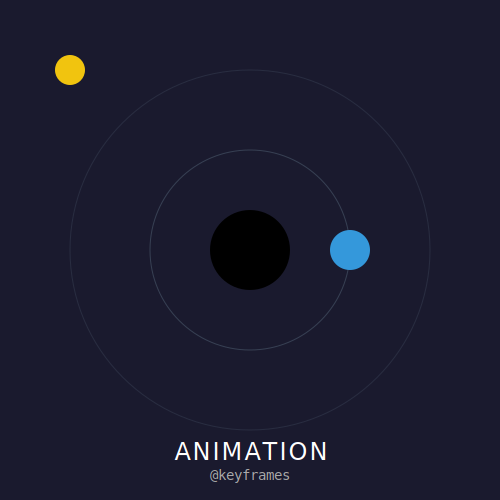

# RECURSO VISUAL: ILUSTRACIÓN DEL TEMA



# ANIMACIÓN CON CSS: DANDO VIDA AL VECTOR

**Tiempo estimado**: 45 minutos
**Nivel**: Intermedio
**Prerrequisitos**: CSS Básico, SVG Básico

## ¿Por qué importa este concepto?
Un SVG estático es bonito, pero un SVG animado cuenta una historia.
La gran ventaja de SVG es que **ES** código, lo que significa que puedes acceder a sus partes internas (paths, círculos, grupos) y animarlas usando las herramientas estándar de la web: CSS.
No necesitas aprender una librería de animación compleja para hacer que un icono lata, gire o cambie de color. Si sabes CSS, ya sabes animar SVG.

## Conexión con conocimientos previos
Usaremos las propiedades de presentación que ya conoces (`fill`, `stroke`, `opacity`, `transform`) pero las cambiaremos en el tiempo usando `@keyframes`.

---

## Comprensión intuitiva
Imagina que eres un director de cine.
1.  **El Actor**: Tu elemento SVG (ej. un círculo).
2.  **El Guion**: La regla `@keyframes`. "En el segundo 0 estás aquí, en el segundo 2 estás allá".
3.  **La Acción**: La propiedad `animation` asignada al actor.

---

## Definición formal

### Propiedades Animables en SVG
Casi todos los atributos de presentación son animables:
- **Color**: `fill`, `stroke`.
- **Geometría (CSS transform)**: `transform: rotate() | scale() | translate()`.
- **Trazo**: `stroke-dasharray`, `stroke-dashoffset` (el truco de "dibujado automático").
- **Opacidad**: `opacity`.

*Nota: Atributos geométricos puros como `x`, `y`, `r`, `d` NO se pueden animar con CSS en todos los navegadores. Para movimiento complejo de rutas, se usa `transform` o SMIL/JS.*

---

## Implementación práctica

### El Corazón Latiente (Transform + Scale)

```xml
<svg viewBox="0 0 100 100" xmlns="http://www.w3.org/2000/svg">
  <style>
    /* Definimos la animación */
    @keyframes latido {
      0% { transform: scale(1); }
      50% { transform: scale(1.2); }
      100% { transform: scale(1); }
    }
    
    /* Asignamos al elemento */
    .corazon {
      fill: red;
      /* Importante: transform-origin en el centro para escalar desde ahí */
      transform-origin: center; 
      animation: latido 1s infinite ease-in-out;
    }
  </style>

  <path class="corazon" d="M50 30..." /> <!-- Imagina un path de corazón -->
</svg>
```

### El Efecto de "Dibujado Automático" (Stroke Dasharray)
Este es el truco más famoso de SVG.
1. Haz el trazo punteado (`stroke-dasharray`).
2. Haz que el punto sea tan largo como toda la línea.
3. Desplaza el trazo (`stroke-dashoffset`) para ocultarlo y muévelo a 0 para revelarlo.

```xml
<svg viewBox="0 0 200 100">
  <style>
    @keyframes dibujar {
      to { stroke-dashoffset: 0; }
    }
    
    .linea {
      fill: none;
      stroke: black;
      stroke-width: 5;
      /* Longitud total de la línea (imagina que mide 200px) */
      stroke-dasharray: 200;
      /* Empezamos ocultando todo (desplazado 200px) */
      stroke-dashoffset: 200;
      animation: dibujar 2s linear forwards;
    }
  </style>
  
  <path class="linea" d="M 0 50 H 200" />
</svg>
```

---

## Errores frecuentes

### ❌ Error 1: Transform Origin
Por defecto en CSS, `transform-origin` es `50% 50%` del elemento (su centro).
PERO en SVG, históricamente el sistema de coordenadas puede ser confuso.
Si tu animación de rotación hace que el objeto "orbite" locamente en vez de girar sobre sí mismo, fuerza explícitamente:
`transform-box: fill-box; transform-origin: center;`

### ❌ Error 2: Intentar animar `d` con CSS
Muchos quieren hacer "morphing" (transformar un cuadrado en círculo) con CSS.
`transition: d 1s;`
Esto solo funciona en algunos navegadores modernos (Chrome) y requiere que ambos paths tengan EL MISMO número de puntos y comandos. Para producción segura, usa librerías de JS (GSAP, Anime.js).

---

## Resumen del concepto

**En una frase**: Usa CSS `@keyframes` para modificar estilos (`fill`, `transform`, `stroke`) en el tiempo.

**Cuándo usarlo**: Loaders, iconos interactivos, efectos de entrada suaves.

**Siguiente paso**: Ya se mueve solo. Ahora haremos que se mueva cuando el usuario lo toque con **Interactividad Básica**.


## 🕹️ LABORATORIO VIRTUAL

> [!TIP]
> **Experiencia Práctica**: Laboratorio: Animación de Trazado
> 
> [Abrir Simulación](../../recursos/simulaciones/sim_3.1.1_dasharray.html)

