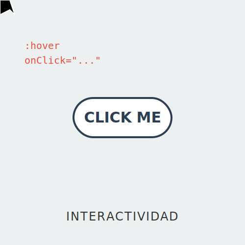

# RECURSO VISUAL: ILUSTRACIÓN DEL TEMA



# INTERACTIVIDAD BÁSICA: EL VECTOR QUE RESPONDE

**Tiempo estimado**: 45 minutos
**Nivel**: Intermedio
**Prerrequisitos**: Animación CSS (Subtema 3.1.1)

## ¿Por qué importa este concepto?
Una imagen vale más que mil palabras, pero una imagen que reacciona a tu tacto vale más que mil imágenes estáticas.
La interactividad transforma un SVG de ser un mero adorno a ser una **Interfaz de Usuario (UI)**.
Botones que se iluminan, mapas que muestran datos al pasar el mouse, diagramas que revelan detalles al hacer clic. SVG tiene todo esto integrado.

## Conexión con conocimientos previos
Tu SVG ya es parte del DOM (Document Object Model). Eso significa que el navegador sabe cuándo el mouse está encima (`:hover`) y sabe cuándo haces clic. No necesitas magia extra.

---

## Comprensión intuitiva
Hay dos niveles de interactividad:
1.  **Nivel CSS (Reflejos)**: "Si me tocas, cambio de color". Rápido, simple, sin código complejo. Se hace con pseudo-clases.
2.  **Nivel JS (Cerebro)**: "Si me haces clic, calculo la ruta más corta a Marte y te la muestro". Lógica compleja. Se hace con Event Listeners.

---

## Definición formal

### Pseudo-clases CSS en SVG
- **`:hover`**: Cuando el cursor está sobre el elemento.
- **`:active`**: Mientras se presiona el botón del mouse.
- **`:focus`**: Cuando el elemento tiene el foco del teclado (importante para accesibilidad).
- **Clases custom**: `.is-selected` (añadida por JS).

### Eventos JS
Acceso directo al nodo DOM del SVG.
`elemento.addEventListener('click', funcion)`

---

## Implementación práctica

### El Botón Interactivo (CSS Puro)

```xml
<svg viewBox="0 0 200 60">
  <style>
    .boton {
      fill: #007bff;
      transition: fill 0.3s, transform 0.1s;
      cursor: pointer; /* Mano al pasar el mouse */
    }
    
    /* Estado Hover: Cambio de color */
    .boton:hover {
      fill: #0056b3;
    }
    
    /* Estado Active: Efecto de presión */
    .boton:active {
      transform: scale(0.98);
      transform-origin: center;
    }
    
    .texto {
      fill: white;
      pointer-events: none; /* Deja que el clic pase al rect de abajo */
      font-family: sans-serif;
    }
  </style>

  <g>
    <rect class="boton" width="200" height="60" rx="10" />
    <text class="texto" x="100" y="38" text-anchor="middle">Click Me</text>
  </g>
</svg>
```

### El Mapa Interactivo (JavaScript Básico)

```xml
<svg viewBox="0 0 100 100" id="mapa">
  <circle id="ciudadA" cx="20" cy="20" r="10" fill="gray" />
  <circle id="ciudadB" cx="80" cy="80" r="10" fill="gray" />
  
  <text id="info" x="50" y="50" text-anchor="middle">Selecciona ciudad</text>
  
  <script>
    // Nota: Dentro de un SVG independiente, los scripts funcionan.
    // Si el SVG está inline en HTML, el script puede estar fuera.
    
    const mapa = document.getElementById('mapa');
    const info = document.getElementById('info');
    
    // Delegación de eventos (un solo listener para todo el mapa)
    mapa.addEventListener('click', (e) => {
      if (e.target.tagName === 'circle') {
        // Resetear todos
        document.querySelectorAll('circle').forEach(c => c.setAttribute('fill', 'gray'));
        
        // Activar el seleccionado
        e.target.setAttribute('fill', 'orange');
        
        // Mostrar info
        info.textContent = "Elegiste: " + e.target.id;
      }
    });
  </script>
</svg>
```

---

## Variantes y Optimizaciones

### `pointer-events`
¿Alguna vez un texto bloqueó tu clic en el botón de abajo?
`pointer-events: none` hace que un elemento sea invisible al mouse. Los clics lo atraviesan. Es esencial para etiquetas de texto encima de formas interactivas.

---

## Errores frecuentes

### ❌ Error 1: Áreas de clic pequeñas
Hacer clic en una línea fina de 1px (`stroke-width: 1`) es imposible.
**Solución**: Añade un trazo transparente grueso encima para aumentar el área de clic.
`<path stroke="transparent" stroke-width="20" ... />`

### ❌ Error 2: Orden de apilamiento (Z-index)
En SVG no existe `z-index`. El orden lo define el orden en el código.
Si tu botón interactivo está cubierto por un rectángulo transparente que pusiste después en el código, el clic nunca llegará al botón.

---

## Resumen del concepto

**En una frase**: CSS (`:hover`) maneja la estética de la interacción; JS (`onclick`) maneja la lógica.

**Cuándo usarlo**: Mapas, infografías, juegos simples, interfaces de usuario ricas.

**Siguiente paso**: ¡Módulo 3 Completado! Tu SVG ya se mueve y responde. En el **Módulo 4 (Proyecto Final)**, combinaremos todo para crear algo realmente profesional.


## 🕹️ LABORATORIO VIRTUAL

> [!TIP]
> **Experiencia Práctica**: Laboratorio: Eventos SVG
> 
> [Abrir Simulación](../../recursos/simulaciones/sim_3.2.1_events.html)

