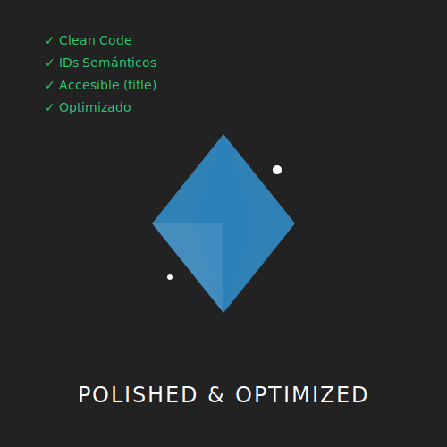

# RECURSO VISUAL: ILUSTRACIÓN DEL TEMA



# IMPLANTACIÓN Y REFINAMIENTO: EL WIDGET COBRA VIDA

**Tiempo estimado**: 90 minutos
**Nivel**: Experto
**Prerrequisitos**: Planificación (Subtema 4.1.1)

## ¿Por qué importa este concepto?
El plan es el mapa, pero la implementación es el territorio.
Ahora vamos a escribir el código final de nuestro Widget de Clima Espacial.
Enfrentaremos problemas reales: "El texto no se centra", "La animación se ve tosca", "El clic no funciona".
Refinar es pulir. Es pasar de "Funciona" a "Se siente profesional".

## Conexión con conocimientos previos
Usaremos TODO:
- `defs/symbol` (M4.1.1)
- `gradients` (M2.1.2)
- `css animation` (M3.1.1)
- `js events` (M3.2.1)

---

## Paso 1: El Código Base (HTML/SVG)
Copiaremos la estructura que planeamos, pero ahora llenando los atributos reales.

```xml
<svg viewBox="0 0 400 300" xmlns="http://www.w3.org/2000/svg" id="mars-widget">
  <defs>
    <!-- Gradiente Atmosférico -->
    <linearGradient id="bg-mars" x1="0" y1="0" x2="0" y2="1">
      <stop offset="0%" stop-color="#ff9966" />
      <stop offset="100%" stop-color="#cc3300" />
    </linearGradient>

    <!-- Icono: Sol Animado -->
    <symbol id="icon-sun" viewBox="0 0 100 100">
      <!-- El sol gira sobre sí mismo -->
      <g class="spin-slow" style="transform-origin: center; transform-box: fill-box">
        <circle cx="50" cy="50" r="25" fill="gold" />
        <line x1="50" y1="10" x2="50" y2="90" stroke="gold" stroke-width="4" />
        <line x1="10" y1="50" x2="90" y2="50" stroke="gold" stroke-width="4" />
      </g>
    </symbol>
  </defs>

  <!-- Fondo -->
  <rect width="100%" height="100%" fill="url(#bg-mars)" rx="20" />

  <!-- Contenido -->
  <g transform="translate(50, 50)">
    <text x="0" y="40" font-family="sans-serif" font-size="40" fill="white" font-weight="bold">MARS</text>
    <text id="temp-display" x="0" y="90" font-family="monospace" font-size="60" fill="white">-60°C</text>
    
    <!-- Icono Clima -->
    <use id="current-icon" href="#icon-sun" x="200" y="0" width="100" height="100" />
  </g>

  <!-- Botón Interactivo -->
  <g id="btn-toggle" transform="translate(130, 230)" cursor="pointer">
    <rect width="140" height="40" rx="20" fill="rgba(255,255,255,0.3)" />
    <text x="70" y="27" text-anchor="middle" fill="white" font-family="sans-serif">SCAN</text>
  </g>

  <!-- JAVASCRIPT INTEGRADO -->
  <script>
    const btn = document.getElementById('btn-toggle');
    const temp = document.getElementById('temp-display');
    
    btn.addEventListener('click', () => {
      // Simulación de escaneo
      temp.textContent = "SCAN...";
      setTimeout(() => {
        // Generar temperatura aleatoria
        const randomTemp = Math.floor(Math.random() * 20) - 80; // -60 a -80
        temp.textContent = randomTemp + "°C";
      }, 500);
    });
  </script>
  
  <!-- ESTILOS CSS -->
  <style>
    @keyframes spin { from { transform: rotate(0deg); } to { transform: rotate(360deg); } }
    .spin-slow { animation: spin 10s linear infinite; }
    
    #btn-toggle:hover rect { fill: rgba(255,255,255,0.5); }
    #btn-toggle:active { transform: translate(130px, 232px); } /* Pequeño desplazamiento abajo */
  </style>
</svg>
```

---

## Paso 2: Refinamiento Visual
El código anterior funciona, pero ¿se ve profesional?
Detalles a pulir:
1.  **Tipografía**: Usa fuentes del sistema (`sans-serif` es seguro, pero importar una fuente de Google Fonts le da carácter).
2.  **Márgenes**: Asegúrate de que los textos no toquen los bordes.
3.  **Feedback**: ¿El botón parece pulsable? Añadimos `cursor: pointer` y efecto `:active`.

---

## Paso 3: Optimización Final
Antes de entregar (o publicar):
1.  **Minificación**: Elimina los comentarios y espacios en blanco excesivos si es para producción web.
2.  **Accesibilidad**: Añade `<title>` y `<desc>` dentro del SVG para lectores de pantalla.
    `<title>Widget del Clima de Marte</title>`
3.  **Unique IDs**: Si vas a poner 2 widgets en la misma página, asegúrate de que los IDs no choquen (o usa Shadow DOM).

---

## Errores frecuentes

### ❌ Error 1: Estilos cortados (Clipping)
Si animas algo para que crezca (`scale`), a veces se corta si se sale del `viewBox`.
**Solución**: Aumenta el `viewBox` o reduce el tamaño de tus elementos para dejar "margen de respiración" interno.

### ❌ Error 2: parpadeo (FOUC)
A veces, antes de cargar el CSS, el SVG se ve "roto" por un milisegundo.
**Solución**: Define propiedades críticas (como `w/h`) en atributos XML, no solo en CSS.

---

## Resumen del concepto

**En una frase**: La implementación es iterativa. Escribe, prueba, ajusta, pule.

**Cuándo usarlo**: Al finalizar cualquier proyecto. El 10% final del esfuerzo da el 90% de la calidad percibida.

**Siguiente paso**: ¡Felicidades! Has completado el **Curso de Creación de SVGs Creativos**. Tienes un portafolio de habilidades que te separa del 95% de los desarrolladores frontend. ¡Sigue creando!


## 🕹️ LABORATORIO VIRTUAL

> [!TIP]
> **Experiencia Práctica**: Ver Resultado Final
> 
> [Abrir Simulación](../../recursos/simulaciones/sim_4.1_weather_preview.html)

