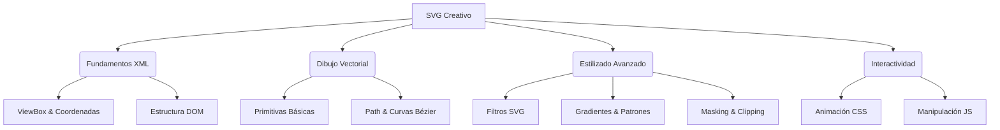

# ARQUITECTURA CURRICULAR: CREACIÓN DE SVGS CREATIVOS

## METADATA

- **Complejidad**: Intermedia
- **Duración estimada**: 5 Horas
- **Audiencia objetivo**: Desarrolladores Frontend y Diseñadores UI
- **Prerrequisitos obligatorios**:
  1. Conocimiento básico de HTML5 (estructura de etiquetas).
  2. Conocimiento básico de CSS3 (selectores y propiedades).
  3. Familiaridad con un editor de código (VS Code recomendado).
- **Fecha de diseño**: 2025-12-20

## MAPA CONCEPTUAL



## OBJETIVOS GENERALES DEL CURSO

1. **Dominar la sintaxis SVG**: Escribir y manipular código SVG manualmente sin depender exclusivamente de herramientas de diseño.
2. **Crear gráficos complejos**: Utilizar `path`, curvas de Bézier y máscaras para construir ilustraciones sofisticadas.
3. **Animar e interactuar**: Dar vida a los gráficos vectoriales mediante animaciones CSS y manipulación básica con JavaScript.

## ESTRUCTURA MODULAR

### MÓDULO 0: Diagnóstico y Fundamentos
**Duración**: 30 min
**Objetivo**: Validar entorno y entender la naturaleza vectorial del SVG.

#### Ruta Única (Nivelación)
- Concepto 0.1: Anatomía de un SVG
  - Objetivo: Identificar la estructura XML, namespace y la etiqueta `<svg>`.
  - Tipo: Teórico
- Concepto 0.2: El Lienzo Infinito (ViewBox)
  - Objetivo: Comprender y manipular el sistema de coordenadas y el atributo `viewBox` para escalar gráficos.
  - Tipo: Práctico

---

### MÓDULO 1: Primitivas y Trazados (El Arte del Path)
**Duración**: 1.5 horas
**Objetivo**: Construir formas complejas comprendiendo la geometría subyacente.

#### TEMA 1.1: Más allá del Rectángulo
- **Subtema 1.1.1**: Formas Básicas (Rect, Circle, Ellipse, Polygon)
  - Objetivo: Implementar figuras geométricas primitivas mediante código.
- **Subtema 1.1.2**: Grupos y Transformaciones (`<g>`, transform)
  - Objetivo: Organizar elementos semánticamente y aplicar rotaciones, escalas y traslaciones.

#### TEMA 1.2: Dominando el elemento `<path>`
- **Subtema 1.2.1**: Comandos de Movimiento y Línea (M, L, H, V, Z)
  - Objetivo: Dibujar formas poligonales complejas usando un solo trazado.
- **Subtema 1.2.2**: Curvas Bézier (C, Q, S, T)
  - Objetivo: Crear formas orgánicas y suaves controlando los puntos de anclaje y control.

---

### MÓDULO 2: Estilizado Avanzado y Efectos
**Duración**: 1.5 horas
**Objetivo**: Crear impacto visual mediante rellenos no sólidos y filtros.

#### TEMA 2.1: Pintura Digital en Código
- **Subtema 2.1.1**: Definiciones y Reutilización (`<defs>`, `<use>`)
  - Objetivo: Optimizar el código SVG definiendo assets reutilizables.
- **Subtema 2.1.2**: Gradientes Lineales y Radiales
  - Objetivo: Aplicar profundidad y volumen mediante transiciones de color.

#### TEMA 2.2: Máscaras y Recortes
- **Subtema 2.2.1**: ClipPath vs Mask
  - Objetivo: Diferenciar y aplicar técnicas de recorte rígido y enmascarado por luminancia.

---

### MÓDULO 3: SVG Vivo (Animación e Interactividad)
**Duración**: 1.5 horas
**Objetivo**: Implementar movimiento y respuesta a eventos del usuario.

#### TEMA 3.1: Animación con CSS
- **Subtema 3.1.1**: Propiedades Animables (stroke-dasharray, fill, transform)
  - Objetivo: Crear efectos de "dibujado automático" y transformaciones suaves.

#### TEMA 3.2: Interactividad Básica
- **Subtema 3.2.1**: Estilos interactivos (:hover, :active en SVG)
  - Objetivo: Crear micro-interacciones visuales sin JavaScript.
- **Subtema 3.2.2**: Manipulación simple con JS
  - Objetivo: Modificar atributos del SVG dinámicamente basado en inputs externos.

---

## MÓDULO 4: Proyecto Integrador - "Iconografía Animada y Reactiva"
**Duración**: En tiempo propio (estimado 1h adicional para completar)
**Objetivo**: Diseñar un set de 3 iconos complejos (ej: Clima, Loader, Toggle) que utilicen paths, gradientes y animaciones.

---

## RECURSOS TÉCNICOS REQUERIDOS
- **Editor**: VS Code con extensiones "SVG" o "SVG Preview".
- **Navegador**: Chrome/Firefox moderno.
- **Herramienta auxiliar opcional**: Inkscape o Figma (solo para comparar código exportado).

## PUNTOS DE EVALUACIÓN
1. **Módulo 0**: Quiz sobre coordenadas y ViewBox.
2. **Módulo 1**: Ejercicio "Trazando el Logo" (replicar un logo simple con `<path>`).
3. **Módulo 2**: Ejercicio "Escudo Heráldico" (uso de gradientes y máscaras).
4. **Módulo 3**: Ejercicio "Loader Infinito" (animación de stroke-dashoffset).

---

## Estructura JSON para Generación

```json
[
  {
    "modulo_id": 0,
    "titulo": "Diagnostico y Fundamentos",
    "temas": [
      {
        "tema_id": "0.1",
        "titulo": "Anatomia de un SVG",
        "subtemas": [
          {
            "subtema_id": "0.1.1",
            "titulo": "Estructura XML y Namespace"
          },
          {
            "subtema_id": "0.1.2",
            "titulo": "El Elemento SVG y ViewBox"
          }
        ]
      }
    ]
  },
  {
    "modulo_id": 1,
    "titulo": "Primitivas y Trazados",
    "temas": [
      {
        "tema_id": "1.1",
        "titulo": "Mas alla del Rectangulo",
        "subtemas": [
          {
            "subtema_id": "1.1.1",
            "titulo": "Formas Basicas"
          },
          {
            "subtema_id": "1.1.2",
            "titulo": "Grupos y Transformaciones"
          }
        ]
      },
      {
        "tema_id": "1.2",
        "titulo": "Dominando el elemento Path",
        "subtemas": [
          {
            "subtema_id": "1.2.1",
            "titulo": "Comandos de Movimiento y Linea"
          },
          {
            "subtema_id": "1.2.2",
            "titulo": "Curvas Bezier"
          }
        ]
      }
    ]
  },
  {
    "modulo_id": 2,
    "titulo": "Estilizado Avanzado y Efectos",
    "temas": [
      {
        "tema_id": "2.1",
        "titulo": "Pintura Digital en Codigo",
        "subtemas": [
          {
            "subtema_id": "2.1.1",
            "titulo": "Definiciones y Reutilizacion"
          },
          {
            "subtema_id": "2.1.2",
            "titulo": "Gradientes Lineales y Radiales"
          }
        ]
      },
      {
        "tema_id": "2.2",
        "titulo": "Mascaras y Recortes",
        "subtemas": [
          {
            "subtema_id": "2.2.1",
            "titulo": "ClipPath vs Mask"
          }
        ]
      }
    ]
  },
  {
    "modulo_id": 3,
    "titulo": "SVG Vivo",
    "temas": [
      {
        "tema_id": "3.1",
        "titulo": "Animacion con CSS",
        "subtemas": [
          {
            "subtema_id": "3.1.1",
            "titulo": "Propiedades Animables y Keyframes"
          }
        ]
      },
      {
        "tema_id": "3.2",
        "titulo": "Interactividad Basica",
        "subtemas": [
          {
            "subtema_id": "3.2.1",
            "titulo": "Pseudo-clases y Eventos Basicos"
          }
        ]
      }
    ]
  }
]
```
